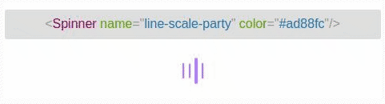
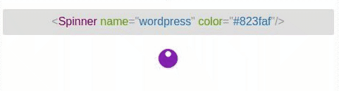
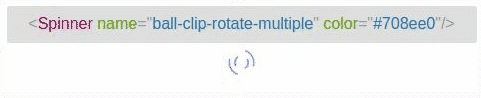
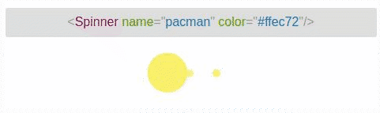

# vue-spinkit

> A collection of loading indicators animated with CSS for VueJS

[](https://img.shields.io/badge/language-vue-green.svg)
[](https://img.shields.io/badge/license-MIT-000000.svg)
[](https://www.npmjs.com/package/vue-spinkit)
[](https://npmjs.org/package/vue-spinkit)
[](https://app.travis-ci.com/TonPC64/vue-spinkit)

## Inspiration
* [Spinkit](http://tobiasahlin.com/spinkit/) css animated loading
* [react-spinkit](https://github.com/KyleAMathews/react-spinkit)
* [loaders.css](https://connoratherton.com/loaders)

## [DEMO](http://vue-spinkit.surge.sh/)





## Installation

```bash
# use yarn
yarn add vue-spinkit
# use npm
npm install --save vue-spinkit
```

## How to use
```js
import Vue from 'vue'
import Spinner from 'vue-spinkit'

Vue.component('Spinner', Spinner)
```

## In file vue
```html
<Spinner name="circle" color="red"/>
```

## Props

| Name | Type | Default | Description |
|:-----|:-----|:--------|:------------|
| name | string | 'three-bounce' | specify spinner to use (defaults to line-scale-pulse-out-rapid). |
| color | string |  | programmatically set the color of the spinners; this can either be a hex value or a color word. |
| noFadeIn | boolean | false | set use fade in |
| fadeIn | string | 'full' | set the time before the spinner fades in. Have 'full', 'half' and 'quarter' |
| className | string | | add a custom classname to the outer div |
| width | string | | set width of spinner |
| height | string | | set heght of spinner |
